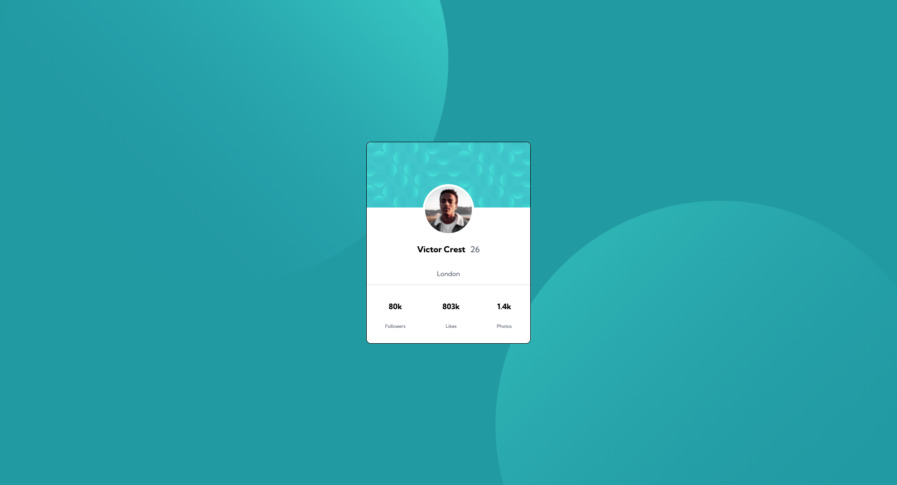
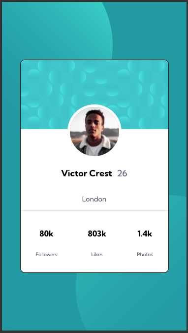

# Frontend Mentor - Profile card component solution

This is a solution to the [Profile card component challenge on Frontend Mentor](https://www.frontendmentor.io/challenges/profile-card-component-cfArpWshJ). Frontend Mentor challenges help you improve your coding skills by building realistic projects.

## Table of contents

- [Overview](#overview)
  - [The challenge](#the-challenge)
  - [Screenshot](#screenshot)
  - [Links](#links)
- [My process](#my-process)
  - [Built with](#built-with)
  - [What I learned](#what-i-learned)
- [Author](#author)
- [Acknowledgments](#acknowledgments)

## Overview

### The challenge

- Build out the project to the designs provided

### Screenshot

### Links

- Solution URL: [GitHub](https://github.com/LEstebanR/FM_Profile_Card_Component)
- Live Site: [URL](https://lestebanr.github.io/FM_Profile_Card_Component/)

## My process

### Built with

- Semantic HTML5 markup
- CSS custom properties
- Mobile-first workflow

### What I learned

This challenge helped me to improve my CSS skills, especially I understood some background things I didn't know well and I practiced HTML layout.

## Author

- Website - [LEsteban](https://www.lesteban.dev/)
- Frontend Mentor - [@LEstebanR](https://www.frontendmentor.io/profile/LEstebanR)

## Acknowledgments

Thank you Fronter Mentor, you're amazing!
